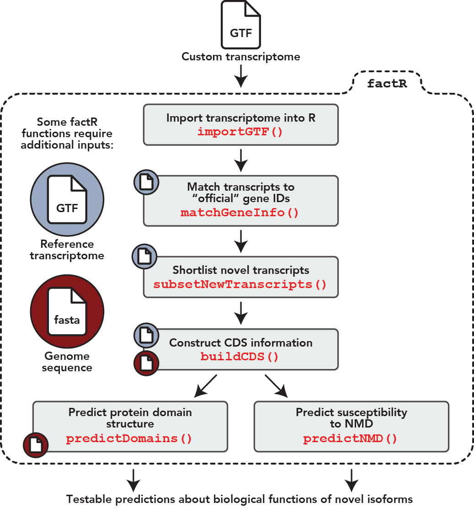

# **factR**: Functional Annotation of Custom Transcriptomes in R

<!-- badges: start -->
  [](https://github.com/fursham-h/factR/actions)
  [](https://github.com/fursham-h/factR/actions)
<!-- badges: end -->
  
## General workflow
<p align="center">
  
</p>

*factR* is a robust and easy-to-use R package with tools to process 
custom-assembled transcriptomes (GTF). Below are *factR*'s key functions:

* Core features 
  1. Construct transcript coding (CDS) information 
  using a reference-guided process
  2. Predict protein domains on coding transcripts
  3. Predict sensitivity of coding transcripts to Nonsense-mediated decay
  4. Annotate and compare spliced segments
  5. Identify NMD-causing exons
  6. [**NEW**] Score NMD-causing exons for conservation
* Supporting features 
  1. Match chromosome levels of query GTF/object to reference annotation
  2. Match gene_id and gene_names of query GTF to reference annotation
  3. Plot transcripts from GTF GRanges object using *wiggleplotr*
  4. Select new transcripts from custom transcriptome

## How to install
The latest version of *factR* can be 
downloaded directly from GitHub as such:
```r
# install.packages("devtools")
devtools::install_github("fursham-h/factR")
```


## What you need
1. Custom-assembled transcriptome (GTF)
2. Reference annotation as GenomicRanges object. Obtained from:
    * Resource database including AnnotationHub
    * Import of reference annotation assembly (GTF/GFF3)
3. Genomic sequence. Obtained from:
    * Resource database including BSGenome, AnnotationHub
    * Import of genomic fasta file


## Getting started
See our [vignette](https://fursham-h.github.io/factR/articles/factR.html) 
for full instructions on how to get started

## Reporting bugs and issues
If you encounter a bug with *factR*, please file an issue on 
[GitHub](https://github.com/fursham-h/factR/issues).

## Acknowledgements
We thank [Kaur Alasoo](https://github.com/kauralasoo) for sharing code 
resources for *wiggleplotr* and for valuable discussions on the design 
of the package.

## References
Fursham Hamid, Kaur Alasoo, Jaak Vilo, Eugene Makeyev (2021); 
Functional annotation of custom transcriptomes; Methods in Molecular Biology


